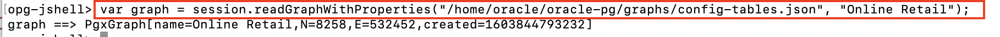

# Create Property Graph

## Introduction

A property graph consists of a set of objects or vertices and a set of arrows or edges connecting the vertices. Vertices and edges can have multiple properties, which are represented as key-value pairs.

>Each **vertex** has a unique identifier and can have a set of outgoing edges; a set of incoming edges; and a collection of properties.
>
>Each **edge** has a unique identifier and can have an outgoing vertex; an incoming vertex; a text label that describes the relationship between the two vertices; and a collection of properties.

Depending on your needs, there are two different approaches to how you can create property graphs in Oracle Database.

* **Graph Database Use Case.** Store data as a property graph in Oracle Database and manage that data via graph APIs. Optionally, you may use in-memory graph server (**PGX**) as an accelerator for expensive queries or to run graph algorithms on the entire graph. Note that the use of PGX is optional in this use case. For some applications the capabilities available in the database only are sufficient.

* **Analytics-only Use Case.** Data is stored in relational form in the Oracle Database and you are not interested in a "graph database" but still want to benefit from the analytical capabilities of PGX, which exploit the connectivity of your data for specific analytical use cases. The Graph Server is capable of creating an in-memory property graph directly from the Oracle database, either from relational tables or Oracle Database Property Graph objects.

In this lab you will use PGX to create a property graph representation of the relational dataset (analytics-only use case).

## **STEP 1**: Create an Authentication Token for Graph Server

1. Open a new SSH connection to the lab VM.

2. Generate and use a token for making authenticated remote requests to the graph server.

  Run the following command to sign in to the graph server and create the token, replacing **{RETAIL_PASSWORD}** with the password of the RETAIL schema :

```
<copy>
curl -X POST -H 'Content-Type: application/json' -d '{"username": "retail", "password": "{RETAIL_PASSWORD}"}' http://localhost:7007/auth/token
</copy>
```

3. Copy the token as shown below and paste it in a text editor. You can now use this token to make authenticated remote requests to the graph server.


## **STEP 2** : Create a Graph Config JSON File

To define the graph configuration to load, you need to create a JSON file describing the location and properties of the graph. The file tells the Graph Server's in-memory analytics engine where to source the data from, the data definitions and the Keystore alias to use.

For example, when the source data is in relational format, the configuration file specifies a mapping from relational to graph format by using the concept of vertex and edge providers.

The following steps will create a config file for PGX to load **Oracle Retail** graph in memory, sourcing the data directly from relational tables in the RETAIL schema.

1. Edit the **config-tables.json** file using your favorite text editor (e.g. **vi** or **vim**).

```
<copy>vi ~/oracle-pg/config-tables.json</copy>
```

2. Replace the **{ADB Service Name HIGH}** in **"jdbc_url"** with your Autonomous Database service name, as follows :

```
<copy>
"jdbc_url": "jdbc:oracle:thin:@{ADB Service Name HIGH}"
</copy>
```


3. **Save** the file and **Exit** the editor (in vi/vim, press **Esc**, type **:wq** and hit **ENTER**).

## **STEP 3**: Create the Property Graph using JShell

1. Connect to Graph Server using Graph Client (JShell) and the authentication token just created using an **opg-jshell** session.

```
<copy>
/opt/oracle/graph/bin/opg-jshell -b http://localhost:7007 --secret_store /home/oracle/oracle-pg/keystore.p12
</copy>
```

2. You will be asked to enter the token created in the previous step. **Paste** the token that you have copied earlier.

3. Enter the Keystore password when prompted. Upon a successful login, you will get the **opg-jshell** prompt as follows :


4. Load the graph using the JSON file **/home/oracle/oracle-pg/config-tables.json**.

```
<copy>
var graph = session.readGraphWithProperties("/home/oracle/oracle-pg/config-tables.json", "Online Retail");
</copy>
```


5. Test the graph by running a simple query that displays the list of products purchased by a customer.

```
opg-jshell> <copy>graph.queryPgql(" SELECT ID(c), ID(p), p.description FROM MATCH (c)-[has_purchased]->(p) WHERE ID(c) = 'cust_12353' ").print();
</copy>
```


## **STEP 4**: Compute Page Rank using PPR

Page Rank (PR) measures stationary distribution of one specific kind of random walk that starts from a random vertex and in each iteration, with a predefined
probability p, jumps to a random vertex, and with probability1-p follows a random outgoing edge of the current vertex.

k (PPR) is the same as PR other
than the fact that jumps are
back to one of a given set of starting vertices.

1. Run Personalized PageRank (PPR) having the customer "cust_12353" as a focused node.

```
opg-jshell> <copy>var vertex = graph.getVertex("cust_12353");</copy>
opg-jshell> <copy>analyst.personalizedPagerank(graph, vertex)
</copy>
```


2. Get the top 10 recommended products.

```
opg-jshell> <copy>
graph.queryPgql(
"  SELECT ID(p), p.description, p.pagerank " +
"  MATCH (p) " +
"  WHERE LABEL(p) = 'Product' " +
"    AND NOT EXISTS ( " +
"     SELECT * " +
"     MATCH (p)-[:purchased_by]->(a) " +
"     WHERE ID(a) = 'cust_12353' " +
"    ) " +
"  ORDER BY p.pagerank DESC" +
"  LIMIT 10"
).print();
</copy>
```


3. When you login to Graph Visualization (next lab), you have the option of connecting to the current JShell session. But for that, you need to get the current **PGX Session ID** so you can use it later at login time.

```
opg-jshell> <copy>session.getId();
</copy>
```


You may proceed to the next lab.

## Acknowledgements

- **Author** - Maqsood Alam, Product Manager, Oracle Database
- **Contributor** - Ryota Yamanaka, Product Manager, Oracle Spatial and Graph
* **Last Updated By/Date** - Maqsood Alam, Oct 2020

## See an issue?
Please submit feedback using this [form](https://apexapps.oracle.com/pls/apex/f?p=133:1:::::P1_FEEDBACK:1). Please include the *workshop name*, *lab* and *step* in your request.  If you don't see the workshop name listed, please enter it manually. If you would like for us to follow up with you, enter your email in the *Feedback Comments* section.
