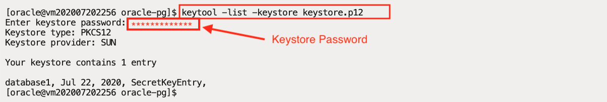

## Create Property Graph

A property graph consists of a set of objects or vertices and a set of arrows or edges connecting the vertices. Vertices and edges can have multiple properties, which are represented as key-value pairs.

>Each **vertex** has a unique identifier and can have a set of outgoing edges; a set of incoming edges; and a collection of properties.
>
>Each **edge** has a unique identifier and can have an outgoing vertex; an incoming vertex; a text label that describes the relationship between the two vertices; and a collection of properties.

Depending on your needs, there are two different approaches to how you can create property graphs in Oracle Database.

* **Graph Database use case.** You store your data as a property graph in Oracle Database and manage that data via graph APIs. Optionally, you may use in-memory graph server (abbreviated as **PGX**) as an accelerator for expensive queries or to run graph algorithms on the entire graph. Note that the use of PGX is optional in this use case. For some applications the capabilities available in the database only are sufficient.

* **Analytics-only use case.** Your data is stored in relational form in the Oracle Database and you want to keep managing that data using standard PL/SQL. You are not interested in a "graph database" but still want to benefit from the analytical capabilities of PGX, which exploit the connectivity of your data for specific analytical use cases.

In this lab you will use PGX to create a property graph representation of the relational dataset (analytics-only use case).

## **STEP 1** : Create a Keystore

As the Graph Server will fetch data from an Oracle Database, you would need a database user with the required privileges, and with a password that must be stored in a Java **keystore** file for protection. Graph Server will then access this keystore for authentication.

In this step you will use **keytool** (bundled with the JDK) to generate the **keystore** file for the **RETAIL** schema.

>As a security best practice, it is preferred that Graph Server connects to the database with a read-only user or a user with "just-the-right" privileges on the schema, instead of the schema owner.

1. Using **Cloud Shell** (or any SSH tool of choice), start an SSH session using your private key **labkey**, **{VM IP Address}**, and the **opc** user.

>Skip this step (and the next) if you already have an SSH session to the compute instance as the **oracle** user.

```
<copy>ssh -i ~/oracle-pg/keys/labkey opc@</copy>{VM IP Address}
```

2. Switch user to **oracle**.

```
<copy>sudo su - oracle</copy>
```

3. Create a new folder **/home/oracle/oracle-pg** to store lab files.

```
<copy>mkdir -p /home/oracle/oracle-pg
cd /home/oracle/oracle-pg</copy>
```

4. Using **keytool**, generate the keystore to hold **RETAIL** user's password (recall the password you've chosen in the previous lab for RETAIL).

  When you run **keytool -importpass**, you will be first prompted to choose a **keystore password** (with verification), and then prompted to enter the **{Retail Password}** (with verification).

>**Please ensure you enter the correct passwords and in the correct order.**

```
<copy>
keytool -importpass -alias database1 -keystore keystore.p12
</copy>
```


5. Using **keytool**, verify the **keystore** was created. Enter the **keystore password** when prompted.

```
<copy>keytool -list -keystore keystore.p12</copy
```


## **STEP 2** : Create a Graph Config JSON File

The Graph Server is capable of creating an in-memory property graph at startup directly from the Oracle database, either from relational tables or Oracle Database Property Graph objects.

To define the graph configuration to load at startup, you need to create a JSON file describing the location and properties of the graph. The file tells the Graph Server's in-memory analytics engine (PGX) where to source the data from, how the data looks like and the keystore alias to use. For example, when the source data is in relational format, the configuration file specifies a mapping from relational to graph format by using the concept of vertex and edge providers.

The following steps will create a config file for PGX (used in a later step) to load **Oracle Retail** graph in memory, sourcing the data directly from relational tables in the RETAIL schema.

1. Create a new file named **config-tables.json** using a command-line text editor of your choice (e.g. **vi** or **vim**).

```
<copy>cd ~/oracle-pg
vi config-tables.json</copy>
```

2. Copy/paste the following content into the editor.

```
<copy>{
  "jdbc_url":"jdbc:oracle:thin:@{ADB Service Name HIGH}",
  "username":"retail",
  "keystore_alias":"database1",
  "name":"retail",
  "vertex_providers": [
    {
      "name":"Customer",
      "format":"rdbms",
      "database_table_name":"CUSTOMERS",
      "key_column":"CUSTOMER_ID",
      "key_type":"string",
      "props":[
        {"name":"COUNTRY", "type":"string"}
      ]
    },
    {
      "name":"Product",
      "format":"rdbms",
      "database_table_name":"PRODUCTS",
      "key_column":"STOCK_CODE",
      "key_type":"string",
      "props":[
        {"name":"DESCRIPTION", "type":"string"}
      ]
    }
  ],
  "edge_providers": [
    {
      "name":"has_purchased",
      "format":"rdbms",
      "database_table_name":"PURCHASES",
      "key_column":"PURCHASE_ID",
      "source_column":"CUSTOMER_ID",
      "destination_column":"STOCK_CODE",
      "source_vertex_provider":"Customer",
      "destination_vertex_provider":"Product",
      "props":[
        {"name":"QUANTITY", "type":"integer"},
        {"name":"UNIT_PRICE", "type":"double"}
      ]
    },
    {
      "name":"purchased_by",
      "format":"rdbms",
      "database_table_name":"PURCHASES",
      "key_column":"PURCHASE_ID",
      "source_column":"STOCK_CODE",
      "destination_column":"CUSTOMER_ID",
      "source_vertex_provider":"Product",
      "destination_vertex_provider":"Customer",
      "props":[
        {"name":"QUANTITY", "type":"integer"},
        {"name":"UNIT_PRICE", "type":"double"}
    ]
  }
]
}
</copy>
```

3. Replace the **{ADB Service Name HIGH}** with your Autonomous Database service name.

  **Save** the file and **Exit** the editor (in vi/vim, press **Esc**, type **:wq** and hit **ENTER**).


## **STEP 3** : Install Oracle Graph Server

Oracle Graph Server and Client is a software package that works with Oracle Database. It includes the in-memory analytics server (PGX) and client libraries required to work with the Property Graph feature in Oracle Database. The package simplifies installation and provides access to the latest graph features and updates.

1. Download the Oracle Graph Server using a Pre-Authenticated Request (PAR) URL.

```
<copy>wget https://objectstorage.us-phoenix-1.oraclecloud.com/n/oraclepartnersas/b/oracle_pg/o/oracle-graph-20.2.0.x86_64.rpm</copy>
```

2. Install the Graph Server.

````
<copy>sudo yum install -y oracle-graph-20.2.0.x86_64.rpm</copy>
````


3. The Graph server is a web application that listens on port 7007 by default. The Linux firewall will block this port, unless specifically opened by a rule, using the following commands.

```
<copy>sudo firewall-cmd --permanent --zone=public --add-port=7007/tcp</copy>
```
```
<copy>sudo firewall-cmd --reload</copy>
```


## **STEP 4** : Configure Oracle Graph Server

As mentioned earlier, the Graph Server needs to be configured at startup to load the **Oracle Retail** graph using the config file created earlier.

1. First, edit the graph server configuration file **/etc/oracle/graph/server.conf** using your favorite text editor.

```
<copy>vi /etc/oracle/graph/server.conf</copy>
```

2. Modify the line  **`"enable_tls": true`** to  **`"enable_tls": false`**.

  **SAVE** the file and **EXIT**.


3. Next, edit the configuration file for the Graph Server PGX engine located at **/etc/oracle/graph/pgx.conf**.

```
<copy>vi /etc/oracle/graph/pgx.conf</copy>
```

4. Add a reference to the PGX config file created earlier (**/home/oracle/oracle-pg/config-tables.json**) for **Oracle Retail**, using **preload_graphs** clause.

```
<copy>{"path": "/home/oracle/oracle-pg/config-tables.json", "name": "Online Retail"}</copy>
```


5. **SAVE** the file and **EXIT**.

## **STEP 5** : Start Graph Server

Configure the Java environment prior to starting the Graph Server.

1. Setup **JAVA\_OPTS** to use the autonomous database wallet, which is downloaded in the /home/oracle/wallets/ADB_Wallet folder.

```
<copy>export JAVA_OPTS="-Doracle.net.tns_admin=/home/oracle/wallets/ADB_Wallet -Doracle.jdbc.fanEnabled=false"</copy>
```

2. Start the Graph server using the **start-server** command. Note the **--secret-store** clause is used to specify the keystore created earlier.

```
<copy>/opt/oracle/graph/pgx/bin/start-server --secret-store /home/oracle/oracle-pg/keystore.p12</copy>
```

3. Enter the **keystore** password when prompted.


4. Wait for a few minutes for the Graph Server to start and load the **Online Retail** graph from the autonomous database. You see the message **"INFO: Starting ProtocolHandler ["http-nio-7007"]""** once the startup is successful.


## **STEP 6**: Validate Property Graph

The Graph Server automatically runs a graph visualization tool **GraphViz** on port 7007. Verify the Graph Server startup using GraphViz.

1. From your laptop/desktop, open a new web browser window and point to the following URL, replacing the **{VM IP Address}** with your lab compute instance IP Address.

```
<copy>http://</copy>{VM IP Address}<copy>:7007/ui</copy>
```

2. Verify you are presented the following home page for **GraphViz**.


3. Observe the graph **Online Retail** shows up in the drop-down as in the screenshot as this is the indication that the graph was successfully loaded at startup.


4. Run a sample PGQL Graph query on **Retail Graph**. Modify the row **LIMIT** to **1000** and click the **Run** button.


## Summary

You have successfully created the property graph representation of sample dataset using Oracle Autonomous Database and Oracle Graph Server. Please proceed to the next lab using the **Lab Contents** menu on your right.
- If the menu is not displayed, click the menu button  on the top right  make it visible
