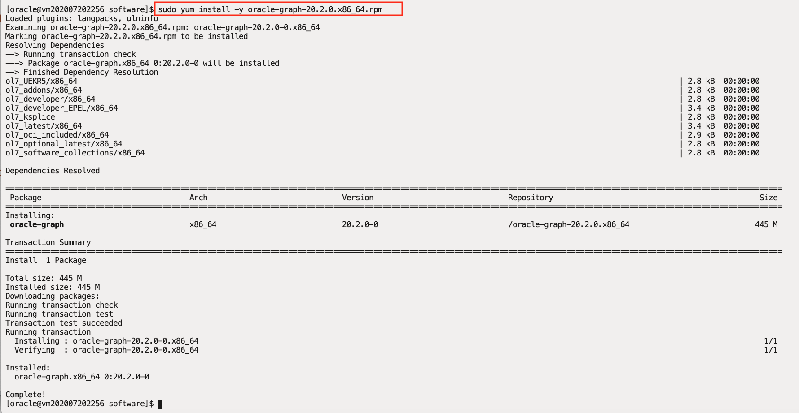
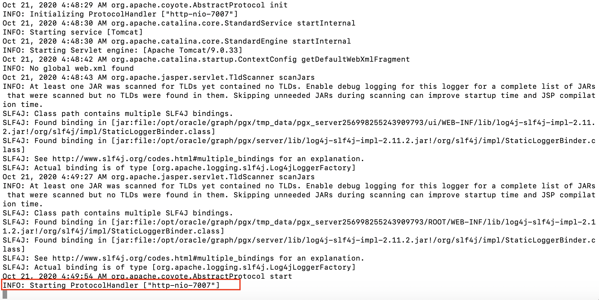

# Install Oracle Graph Server

## Introduction

Oracle Graph Server is a software package for use with the Property Graph feature of Oracle Database. Oracle Graph Server includes the high speed in-memory analytics server (PGX) and client libraries required for graph applications.

> You can work with graphs in two-tier mode (graph client connects directly to Oracle Database), or three-tier mode (graph client connects to the graph server (PGX) on the middle-tier, which then connects to Oracle Database).

## **STEP 1** : Create a Keystore

As the Graph Server will fetch data from an Oracle Database, you would need a database user with the required privileges, and with a password that must be stored in a Java **keystore** file for protection. Graph Server will then access this keystore for authentication.

In this step you will use **keytool** (bundled with the JDK) to generate the **keystore** file for the **RETAIL** schema.

>As a security best practice, it is preferred that Graph Server connects to the database with a read-only user or a user with "just-the-right" privileges on the schema, instead of the schema owner.

1. In the SSH session ensure you are logged in as **oracle**. Change directory to **/home/oracle/oracle-pg**.

```
<copy>cd /home/oracle/oracle-pg</copy>
```

2. Using **keytool**, generate the keystore to hold **RETAIL** user's password (recall the password you've chosen in the previous lab for RETAIL).

  When you run **keytool -importpass**, you will be first prompted to choose a **keystore password** (with verification), and then prompted to enter the **{Retail Password}** (with verification).

>**Please ensure you enter the correct passwords and in the correct order.**

```
<copy>
keytool -importpass -alias database1 -keystore keystore.p12
</copy>
```


3. Using **keytool**, verify the **keystore** was created. Enter the **keystore password** when prompted.

```
<copy>
keytool -list -keystore keystore.p12
</copy>
```


## **STEP 2** : Install Graph Server

The package simplifies installation and provides access to the latest graph features and updates.

1. Download the Oracle Graph Server using a Pre-Authenticated Request (PAR) URL.

```
<copy>wget https://objectstorage.us-phoenix-1.oraclecloud.com/n/oraclepartnersas/b/oracle_pg/o/oracle-graph-20.4.0.x86_64.rpm</copy>
```

2. Install the Graph Server.

````
<copy>sudo yum install -y oracle-graph-20.4.0.x86_64.rpm</copy>
````


3. The Graph server is a web application that listens on port 7007 by default. The Linux firewall will block this port, unless specifically opened by a rule, using the following commands.

```
<copy>sudo firewall-cmd --permanent --zone=public --add-port=7007/tcp</copy>
```
```
<copy>sudo firewall-cmd --reload</copy>
```


## **STEP 3** : Configure Oracle Graph Server

The Graph Server needs to be configured before loading any graphs. Please follow the below instructions to configure Graph Server.

1. First, edit the graph server configuration file **/etc/oracle/graph/server.conf** using your favorite text editor (mainly, **vi** or **vim**).

>When editing with vi or vim, press **i** to enable the **INSERT** mode before pasting.

```
<copy>vi /etc/oracle/graph/server.conf</copy>
```

2. Modify **"enable_tls"** to **false**. **SAVE** the file and **EXIT**.

>To save the file and exit in vi/vim, press **Esc**, type **:wq** and hit **ENTER**.


3. Next, edit the configuration file for the Graph Server PGX engine located at **/etc/oracle/graph/pgx.conf**.

```
<copy>vi /etc/oracle/graph/pgx.conf</copy>
```

4. Modify the **jdbc\_url** to point to the autonomous database, replacing **"< REPLACE-WITH-DATABASE-URL-TO-USE-FOR-AUTHENTICATION >"** with your ADB service name (Hint: scroll down to **pgx\_realm** section to locate **jdbc\_url**).

```
<copy>
"jdbc_url": "jdbc:oracle:thin:@{ADB Service Name HIGH}"
</copy>
```


5. **SAVE** the file and **EXIT**.

## **STEP 4** : Start Graph Server

Configure the Java environment prior to starting the Graph Server.

1. Setup **JAVA\_OPTS** to use the autonomous database wallet, which is downloaded in the /home/oracle/wallets/ADB_Wallet folder.

```
<copy>export JAVA_OPTS="-Doracle.net.tns_admin=/home/oracle/wallets/ADB_Wallet -Doracle.jdbc.fanEnabled=false"</copy>
```

2. Start the Graph server using the **start-server** command. Note the **--secret-store** clause is used to specify the keystore created earlier.

```
<copy>/opt/oracle/graph/pgx/bin/start-server --secret-store /home/oracle/oracle-pg/keystore.p12</copy>
```

3. Enter the **keystore** password when prompted.


4. Wait for a few minutes for the Graph Server to start. Observe the message **"INFO: Starting ProtocolHandler ["http-nio-7007"]""** on a successful startup.



5. **DO NOT** close this SSH session as doing so will stop the Graph Server.

You may proceed to the next lab.

## Acknowledgements

- **Author** - Maqsood Alam, Product Manager, Oracle Database
- **Contributor** - Ryota Yamanaka, Product Manager, Oracle Spatial and Graph
* **Last Updated By/Date** - Maqsood Alam, Oct 2020

## See an issue?
Please submit feedback using this [form](https://apexapps.oracle.com/pls/apex/f?p=133:1:::::P1_FEEDBACK:1). Please include the *workshop name*, *lab* and *step* in your request.  If you don't see the workshop name listed, please enter it manually. If you would like for us to follow up with you, enter your email in the *Feedback Comments* section.
