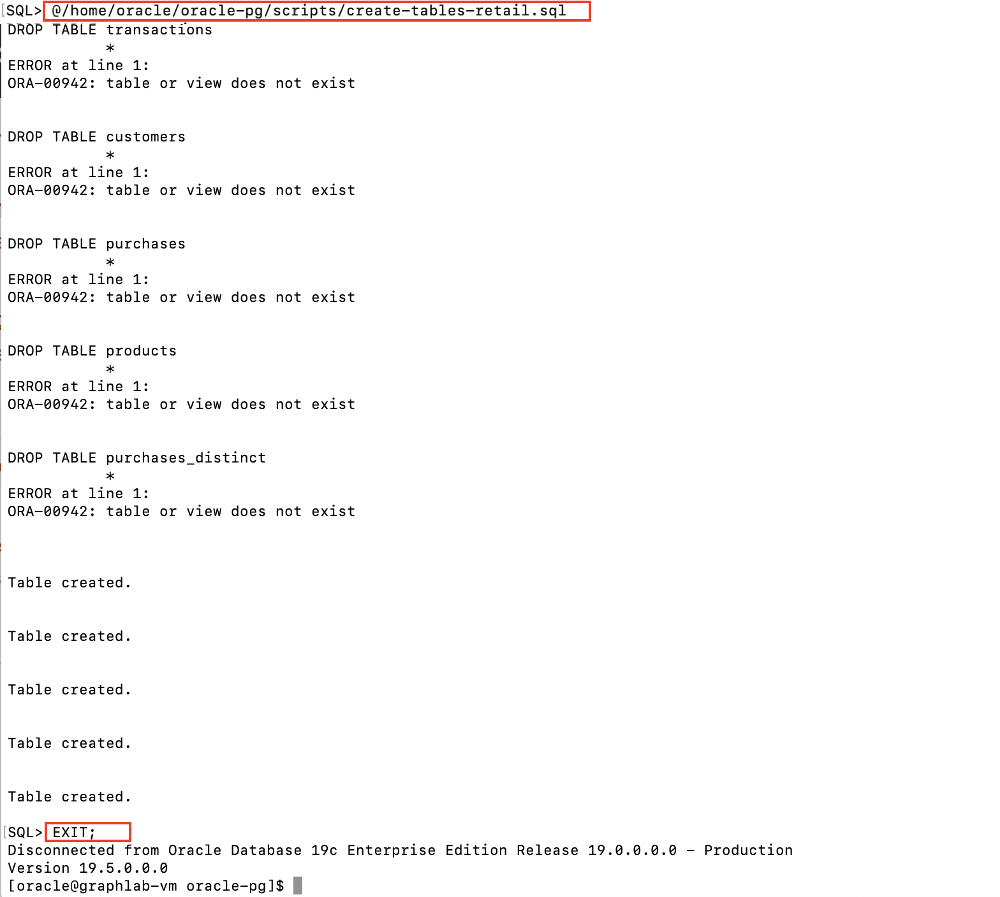
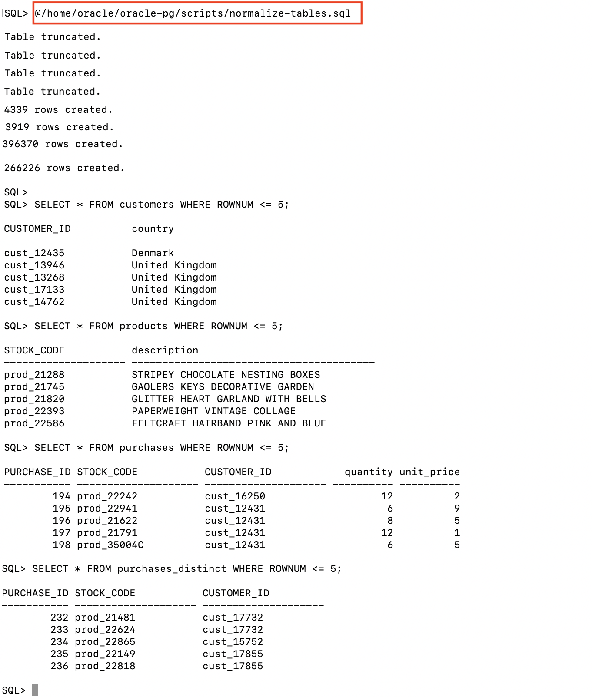

# Load Retail Dataset

## Introduction

An open dataset of retail transactions is available for download from [UCI](https://archive.ics.uci.edu/ml/datasets/online+retail) (and also [Kaggle](https://www.kaggle.com/jihyeseo/online-retail-data-set-from-uci-ml-repo)). This dataset contains real-world transactions of customer purchases along with product and customer data - suitable to showcase a Graph-based recommendation engine use case.

>According to [UCI Machine Learning Repository](https://archive.ics.uci.edu/ml/datasets/online+retail), "the Online Retail Dataset is a transnational data set which contains all the transactions occurring between 01/12/2010 and 09/12/2011 for a UK-based and registered non-store online retail. The company mainly sells unique all-occasion gifts. Many customers of the company are wholesalers."

## **STEP 1** : Download the Dataset

1. Using **Cloud Shell** (or any SSH tool of choice), start an SSH session using your private key **labkey**, **{VM IP Address}**, and **opc** user.

```
<copy>ssh -i ~/oracle-pg/keys/labkey opc@</copy>{VM IP Address}
```

2. Switch the user to **oracle** and change directory to **/home/oracle/dataset**.

````
<copy>sudo su - oracle
cd /home/oracle/dataset</copy>
````


3. Download the Online Retail dataset using **wget** using a direct download URL from UCI.

````
<copy>wget https://archive.ics.uci.edu/ml/machine-learning-databases/00352/Online%20Retail.xlsx -O OnlineRetail.xlsx</copy>
````


4. Once the download completes, convert the file (Excel) to CSV format using open source **libreoffice**, as the data needs to be converted to plain text for loading.

>The file conversion takes a few minutes to complete.

````
<copy>libreoffice --headless --convert-to csv OnlineRetail.xlsx</copy>
````


## **STEP 2** : Create the Database Schema

1. In the previous SSH session connected as the **oracle** user, start a SQL Plus session and connect as the **ADMIN** user using **{ADB Admin Password}** and to **{ADB Service Name HIGH}** database service.

```
<copy>sqlplus ADMIN/</copy>{ADB Admin Password}@{ADB Service Name HIGH}
```

2. In the SQL Plus session, create the **RETAIL** database user with a suitable **{Retail Password}** conforming to [ADB password rules](https://docs.oracle.com/en/cloud/paas/autonomous-data-warehouse-cloud/user/manage-users-admin.html#GUID-B227C664-EBA0-4B5E-B11C-A56B16567C1B).

```
<copy>CREATE USER retail IDENTIFIED BY </copy>{Retail Password};
```

3. Grant the required privileges to the **RETAIL** user.

````
<copy>ALTER USER retail QUOTA UNLIMITED ON data;
GRANT CONNECT, RESOURCE, CREATE VIEW TO retail;
EXIT;
</copy>
````


4. Start another SQL Plus session and this time log in as the **RETAIL** user using **{Retail Password}**.

```
<copy>sqlplus RETAIL/</copy>{Retail Password}@{ADB Service Name HIGH}
```


5. Create the tables for the dataset using the below SQL script.

>Ignore any **ORA-00942: table or view does not exist** errors.

````
<copy>DROP TABLE transactions;
DROP TABLE customers;
DROP TABLE purchases;
DROP TABLE products;
DROP TABLE purchases_distinct;

CREATE TABLE transactions (
  invoice_no VARCHAR2(255)
, stock_code VARCHAR2(255)
, description VARCHAR2(255)
, quantity NUMBER(10)
, invoice_date VARCHAR2(255)
, unit_price NUMBER(10)
, customer_id NUMBER(10)
, country VARCHAR2(255)
);

CREATE TABLE customers (
  customer_id VARCHAR2(255) PRIMARY KEY
, country VARCHAR2(255)
);

CREATE TABLE products (
  stock_code VARCHAR2(255) PRIMARY KEY
, description VARCHAR2(255)
);

CREATE TABLE purchases (
  purchase_id NUMBER
, stock_code VARCHAR2(255)
, customer_id VARCHAR2(255)
, quantity NUMBER(10)
, unit_price NUMBER(10)
);

CREATE TABLE purchases_distinct (
  purchase_id NUMBER
, stock_code VARCHAR2(255)
, customer_id VARCHAR2(255)
);

EXIT;
</copy>
````


6. Hit **ENTER** to exit the above SQL Plus session.

## **STEP 3** : Load the Dataset in ADB

The retail dataset was earlier converted from Excel to the CSV format making it readable by utilities such as Oracle **SQL Loader**.

In this step you will load the CSV file into the **TRANSACTIONS** table of **RETAIL** schema using SQL Loader.

1. In the previous SSH connection logged in as the **oracle** user, ensure you are in the right folder.

````
<copy>cd /home/oracle/dataset</copy>
````

2. Create a new file named **sqlldr.ctl** using a command-line text editor of your choice (e.g. **vi** or **vim**).

````
<copy>vi sqlldr.ctl</copy>
````

3. Copy/paste the following content into the editor and save the **sqlldr.ctl** file. This file is the control file used by SQL Loader to make sense of the input file format.

````
<copy>OPTIONS (SKIP=1)
LOAD DATA
CHARACTERSET UTF8
TRUNCATE INTO TABLE transactions
FIELDS TERMINATED BY ','
OPTIONALLY ENCLOSED BY '"'
( invoice_no
, stock_code
, description
, quantity
, invoice_date
, unit_price
, customer_id
, country)
</copy>
````


4. Save the file and exit the editor (in vi/vim, press **Esc**, type **:wq** and hit **ENTER**). Ensure the file got created in the folder using **ls**.

```
<copy>ls</copy>
```


5. Invoke SQL Loader using the following command line, replacing **{Retail Password}** and **{ADB Service Name}**.

````
<copy>sqlldr userid=retail/{Retail Password}@{ADB Service Name HIGH} data=OnlineRetail.csv control=sqlldr.ctl log=sqlldr.log bad=sqlldr.bad direct=true</copy>
````


6. In the output above, observe that over 540k rows got loaded.

## **STEP 4** : Populate Tables for Graph

The transactional data that was just loaded needs to be denormalized in a relational set of entities, mainly **CUSTOMERS**, **PRODUCTS**, **PURCHASES** and **PURCHASES_DISTINCT**. These tables will be used to build the Property Graph in the next lab.

1. In the previous SSH connection logged in as the **oracle** user, start a SQL Plus session as the **RETAIL** user.

````
<copy>sqlplus RETAIL/</copy>{Retail Password}@{ADB Service Name HIGH}
````


2. Copy/paste the following SQL script to populate CUSTOMERS, PRODUCTS, PURCHASES and PURCHASES_DISTINCT.

````
<copy>SET LINESIZE 200
COL stock_code FOR a20
COL customer_id FOR a20
COL country FOR a20
COL description FOR a40

TRUNCATE TABLE customers;
TRUNCATE TABLE products;
TRUNCATE TABLE purchases;
TRUNCATE TABLE purchases_distinct;

INSERT INTO customers (customer_id, country)
SELECT 'cust_'||customer_id, MAX(country)
FROM transactions
WHERE stock_code IS NOT NULL
  AND stock_code < 'A'
  AND customer_id IS NOT NULL
  AND quantity > 0
GROUP BY customer_id
;

INSERT INTO products (stock_code, description)
SELECT 'prod_'||stock_code, MAX(description)
FROM transactions
WHERE stock_code IS NOT NULL
  AND stock_code < 'A'
  AND customer_id IS NOT NULL
  AND quantity > 0
GROUP BY stock_code
;

INSERT INTO purchases (purchase_id, stock_code, customer_id, quantity, unit_price)
SELECT ROWNUM AS purchase_id, 'prod_'||stock_code, 'cust_'||customer_id,
       quantity, unit_price
FROM transactions
WHERE stock_code IS NOT NULL
  AND stock_code < 'A'
  AND customer_id IS NOT NULL
  AND quantity > 0
;

INSERT INTO purchases_distinct (purchase_id, stock_code, customer_id)
SELECT ROWNUM AS purchase_id, stock_code, customer_id
FROM (SELECT DISTINCT 'prod_'||stock_code AS stock_code,
      'cust_'||customer_id AS customer_id
      FROM transactions
     WHERE stock_code IS NOT NULL
       AND stock_code < 'A'
       AND customer_id IS NOT NULL
       AND quantity > 0)
;

SET ECHO ON;

SELECT * FROM customers WHERE ROWNUM <= 5;
SELECT * FROM products WHERE ROWNUM <= 5;
SELECT * FROM purchases WHERE ROWNUM <= 5;
SELECT * FROM purchases_distinct WHERE ROWNUM <= 5;

EXIT;
</copy>
````

3. Verify the above script completes successfully.



## Summary

You have successfully loaded the Autonomous Database with the sample dataset. Please proceed to the next lab using the **Lab Contents** menu on your right.
- If the menu is not displayed, click the menu button  on the top right  make it visible
