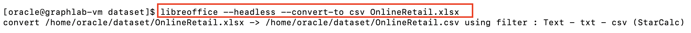
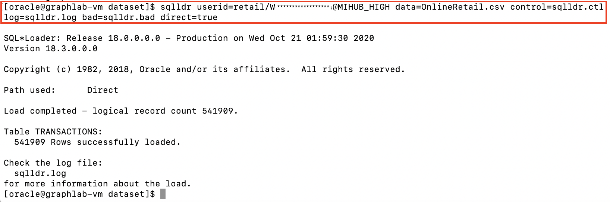

# Load Retail Dataset

## Introduction

An open dataset of retail transactions is available for download from [UCI](https://archive.ics.uci.edu/ml/datasets/online+retail) (and also [Kaggle](https://www.kaggle.com/jihyeseo/online-retail-data-set-from-uci-ml-repo)). This dataset contains real-world transactions of customer purchases along with product and customer data - suitable to showcase a Graph-based recommendation engine use case.

>According to [UCI Machine Learning Repository](https://archive.ics.uci.edu/ml/datasets/online+retail), "the Online Retail Dataset is a transnational data set which contains all the transactions occurring between 01/12/2010 and 09/12/2011 for a UK-based and registered non-store online retail. The company mainly sells unique all-occasion gifts. Many customers of the company are wholesalers."

**IMPORTANT NOTE**

You may continue to use **Cloud Shell** to SSH into your lab environment. However, if you choose to use a different SSH client, please setup your client to connect to the lab VM using the **labkey** generated in the previous lab. Click [here](https://docs.cloud.oracle.com/en-us/iaas/Content/GSG/Tasks/testingconnection.htm) for further instructions.

## **STEP 1** : Download the Dataset

1. Start an SSH session using your private key **labkey**, **{VM IP Address}**, and **opc** user.

````
<copy>ssh -i ~/oracle-pg/keys/labkey opc@</copy>{VM IP Address}
````

2. In the SSH session, switch to user to **oracle** and change directory to **/home/oracle/dataset**.

````
<copy>sudo su - oracle
cd /home/oracle/dataset</copy>
````

3. Download the Online Retail dataset using **wget** using a direct download URL from UCI.

````
<copy>wget https://archive.ics.uci.edu/ml/machine-learning-databases/00352/Online%20Retail.xlsx -O OnlineRetail.xlsx</copy>
````


4. Once the download completes, convert the Excel file to CSV format using open source **libreoffice**, as the data needs to be converted to plain text for loading.

>The file conversion takes a few minutes to complete.

````
<copy>libreoffice --headless --convert-to csv OnlineRetail.xlsx</copy>
````


## **STEP 2** : Create the Database Schema

1. In the previous SSH session connected as the **oracle** user, start a SQL Plus session and connect as the **ADMIN** user using **{ADB Admin Password}** and to **{ADB Service Name HIGH}** database service.

```
<copy>sqlplus ADMIN/</copy>{ADB Admin Password}@{ADB Service Name HIGH}
```

2. In the SQL Plus session, create the **RETAIL** database user with a suitable **{Retail Password}** conforming to [ADB password rules](https://docs.oracle.com/en/cloud/paas/autonomous-data-warehouse-cloud/user/manage-users-admin.html#GUID-B227C664-EBA0-4B5E-B11C-A56B16567C1B).

```
<copy>CREATE USER retail IDENTIFIED BY</copy> {Retail Password};
```

3. Grant the required privileges to the **RETAIL** user.

>The Oracle Graph server by default uses an Oracle database as the identity manager, which means that you log into the graph server using Oracle Database credentials. The Database user needs to be granted appropriate privileges to support this authentication method, mainly the **CREATE SESSION** and  **GRAPH\_DEVELOPER** or **GRAPH\_ADMINISTRATOR** role.

````
<copy>ALTER USER retail QUOTA UNLIMITED ON data;
CREATE ROLE graph_developer;
GRANT CONNECT, RESOURCE, CREATE VIEW, graph_developer TO retail;

EXIT;
</copy>
````


4. Start a SQL Plus session using the **RETAIL** user.

```
<copy>sqlplus RETAIL/</copy>{Retail Password}@{ADB Service Name HIGH}
```

5. Create the tables for the dataset using **create-tables-retail.sql** script located in **~/oracle-pg** folder.

>Ignore any **ORA-00942: table or view does not exist** errors.

````
SQL> <copy>@/home/oracle/oracle-pg/create-tables-retail.sql</copy>
````


6. **EXIT** the above SQL Plus session.

## **STEP 3** : Load the Dataset

The retail dataset was earlier converted from Excel to the CSV format making it readable by utilities such as Oracle **SQL Loader**.

Load the CSV file into **TRANSACTIONS** table using **SQL Loader**.

1. In the previous SSH connection logged in as the **oracle** user, ensure you are in the right folder.

````
<copy>cd /home/oracle/dataset</copy>
````

2. A SQL Loader control file is provided for loading the dataset into the TRANSACTIONS table (control file defines the format of the input file to SQL Loader).

  Invoke SQL Loader using the following command line, replacing **{Retail Password}** and **{ADB Service Name}**.

````
<copy>sqlldr userid=retail/{Retail Password}@{ADB Service Name HIGH} data=OnlineRetail.csv control=sqlldr.ctl log=sqlldr.log bad=sqlldr.bad direct=true</copy>
````


3. Observe that over 540k rows got loaded successfully.

## **STEP 4** : Populate Tables for Graph

The transactional data that was just loaded needs to be normalized in a relational set of entities, mainly **CUSTOMERS**, **PRODUCTS**, **PURCHASES** and **PURCHASES_DISTINCT**. These tables will be used to build the property graph later.

1. In the previous SSH connection logged in as the **oracle** user, start a SQL Plus session as the **RETAIL** user.

````
<copy>sqlplus RETAIL/</copy>{Retail Password}@{ADB Service Name HIGH}
````

2. Populate the normalized tables using **normalize-tables.sql** script located in **~/oracle-pg** folder.

````
SQL> <copy>@/home/oracle/oracle-pg/normalize-tables.sql</copy>
````


3. Verify the above script completes successfully. **EXIT** the SQL session.

You may proceed to the next lab.

## Acknowledgements

- **Author** - Maqsood Alam, Product Manager, Oracle Database
- **Contributor** - Ryota Yamanaka, Product Manager, Oracle Spatial and Graph
* **Last Updated By/Date** - Maqsood Alam, Oct 2020

## See an issue?
Please submit feedback using this [form](https://apexapps.oracle.com/pls/apex/f?p=133:1:::::P1_FEEDBACK:1). Please include the *workshop name*, *lab* and *step* in your request.  If you don't see the workshop name listed, please enter it manually. If you would like for us to follow up with you, enter your email in the *Feedback Comments* section.
