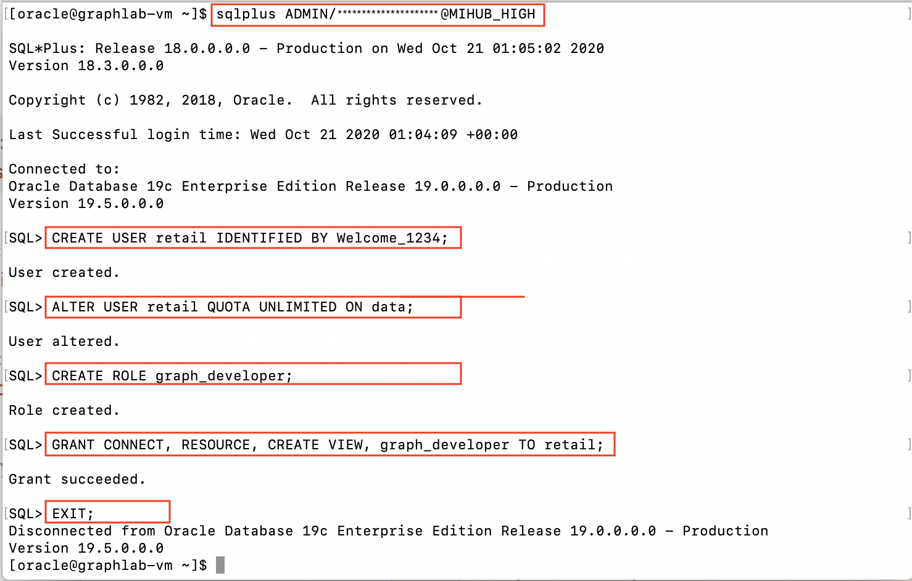
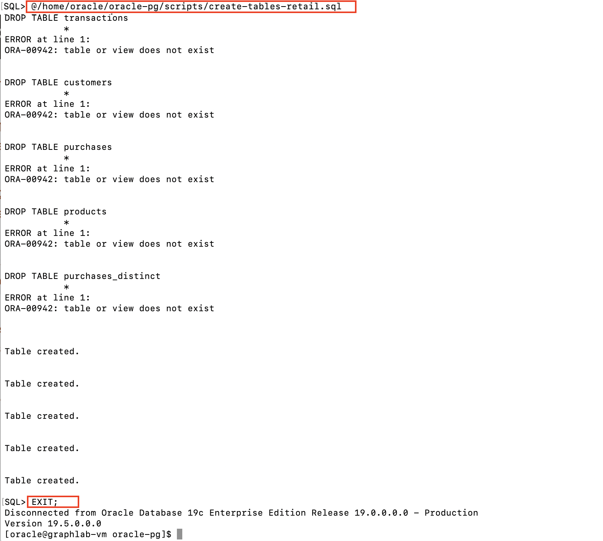

# Load a Retail Dataset

## Introduction

An open dataset of retail transactions is available for download from [UCI](https://archive.ics.uci.edu/ml/datasets/online+retail) (and also [Kaggle](https://www.kaggle.com/jihyeseo/online-retail-data-set-from-uci-ml-repo)). This dataset contains real-world transactions of customer purchases along with product and customer data - very suitable for generating real-time product recommendations based on property graph.

>According to [UCI Machine Learning Repository](https://archive.ics.uci.edu/ml/datasets/online+retail), "the Online Retail Dataset is a transnational data set which contains all the transactions occurring between 01/12/2010 and 09/12/2011 for a UK-based and registered non-store online retail. The company mainly sells unique all-occasion gifts. Many customers of the company are wholesalers."

Estimated Lab Time : 15 minutes

### Objectives

- Create the database schema in Oracle Autonomous Database and load the retail dataset

### Prerequisites

- An Oracle Free Tier, Always Free, Paid or LiveLabs Cloud Account
- Successful completion of all steps in the previous lab

## **STEP 1** : Login to the Compute Instance

You may use [Cloud Shell](https://docs.cloud.oracle.com/en-us/iaas/Content/API/Concepts/cloudshellintro.htm) or any SSH client of your choice to SSH into the lab environment. Whatever method you choose, ensure the **SSH Keys** are setup for the client. Click [here](https://docs.cloud.oracle.com/en-us/iaas/Content/GSG/Tasks/testingconnection.htm ) for configuring various SSH clients to connect to OCI Compute instance.

1. Start an SSH session using your private key **labkey**, **{VM IP Address}**, and **opc** user. The below step assumes you are using the SSH client from the terminal.

    ```
    <copy>ssh -i ~/oracle-pg/keys/labkey opc@{VM IP Address}</copy>
    ```

2. Switch current user to **oracle**. All lab steps are run as the oracle user, so ensure in all sessions that you are connected as **oracle** before running any commands.

    ```
    <copy>sudo su - oracle</copy>
    ```

## **STEP 2** : Create the Database Schema

1. Ensure you are in the SSH session connected as the **oracle** user.

2. Start a SQL Plus session and connect as the **ADMIN** user using **{ADB Admin Password}** and to **{ADB Service Name HIGH}** database service.

    ```
    <copy>sqlplus ADMIN/{ADB Admin Password}@{ADB Service Name HIGH}</copy>
    ```

3. In the SQL Plus session, create the **RETAIL** database user with a suitable **{Retail Password}** conforming to [ADB password rules](https://docs.oracle.com/en/cloud/paas/autonomous-data-warehouse-cloud/user/manage-users-admin.html#GUID-B227C664-EBA0-4B5E-B11C-A56B16567C1B).

    ```
    <copy>CREATE USER retail IDENTIFIED BY {Retail Password};</copy>
    ```

4. Grant the required privileges to the **RETAIL** user.

    >The Oracle Graph server by default uses an Oracle database as the identity manager, which means that you log into the graph server using Oracle Database credentials. The Database user needs to be granted appropriate privileges to support this authentication method, mainly the **CREATE SESSION** and  **GRAPH\_DEVELOPER** or **GRAPH\_ADMINISTRATOR** role.

    ```
    <copy>ALTER USER retail QUOTA UNLIMITED ON data;
    CREATE ROLE graph_developer;
    GRANT CONNECT, RESOURCE, CREATE VIEW, graph_developer TO retail;

    EXIT;
    </copy>
    ```
    

5. Start a SQL Plus session again but this time connect as the **RETAIL** user.

    ```
    <copy>sqlplus RETAIL/{Retail Password}@{ADB Service Name HIGH}</copy>
    ```

6. Create the tables for the dataset using **create-tables-retail.sql** script located in **~/oracle-pg/scripts** folder.

    >Ignore any **ORA-00942: table or view does not exist** errors.

    ```
    SQL> <copy>@/home/oracle/oracle-pg/scripts/create-tables-retail.sql</copy>
    ```

7. **EXIT** the SQL Plus session.

    ```
    SQL> <copy>EXIT;</copy>
    ```
    

## **STEP 3** : Load the Dataset

1. In the previous SSH connection as the **oracle** user, change directory to **/home/oracle/dataset** as all files for the load are in this folder.

    ```
    <copy>cd /home/oracle/dataset</copy>
    ```

2. Download the Online Retail dataset using **wget** using a direct download URL from UCI.

    ```
    <copy>wget https://archive.ics.uci.edu/ml/machine-learning-databases/00352/Online%20Retail.xlsx -O OnlineRetail.xlsx</copy>
    ```
    

3. Once the download completes, convert the Excel file to CSV format using open source **libreoffice**, as the data needs to be converted to plain text for loading.

    >The file conversion takes a few minutes to complete.

    ```
    <copy>libreoffice --headless --convert-to csv OnlineRetail.xlsx</copy>
    ```
    

4. Load the CSV file into **TRANSACTIONS** table using **SQL Loader** and the control file provided (control file defines the format of the input file to SQL Loader).

  Invoke SQL Loader using the following command line, replacing **{Retail Password}** and **{ADB Service Name}**.

    ```
    <copy>sqlldr userid=retail/{Retail Password}@{ADB Service Name HIGH} data=OnlineRetail.csv control=sqlldr.ctl log=sqlldr.log bad=sqlldr.bad direct=true</copy>
    ```
    

5. Observe that over **540k** rows get loaded from the dataset.

## **STEP 4** : Populate Tables for Graph

The transactional data that was just loaded needs to be normalized into relational entities, mainly **CUSTOMERS**, **PRODUCTS**, **PURCHASES** and **PURCHASES_DISTINCT**. These tables will be used to build the property graph later.

1. In the previous SSH connection as the **oracle** user, start a SQL Plus session as the **RETAIL** user.

    ```
    <copy>sqlplus RETAIL/{Retail Password}@{ADB Service Name HIGH}</copy>
    ```

2. Populate the normalized tables using **normalize-tables.sql** script located in **~/oracle-pg/scripts** folder.

    ```
    SQL> <copy>@/home/oracle/oracle-pg/scripts/normalize-tables.sql</copy>
    ```
    

3. Verify the above script completes successfully. **EXIT** the SQL session.

    ```
    SQL> <copy>EXIT;</copy>
    ```

You may now [proceed to the next lab](#next).

## Acknowledgements

- **Author** - Maqsood Alam, Product Manager, Oracle Database
- **Contributor** - Ryota Yamanaka, Product Manager, Oracle Spatial and Graph
* **Last Updated By/Date** - Maqsood Alam, Oct 2020

## Need Help?
Please submit feedback or ask for help using our [LiveLabs Support Forum](https://community.oracle.com/tech/developers/categories/oracle-graph). Please click the **Log In** button and login using your Oracle Account. Click the **Ask A Question** button to the left to start a *New Discussion* or *Ask a Question*.  Please include your workshop name and lab name.  You can also include screenshots and attach files.  Engage directly with the author of the workshop.

If you do not have an Oracle Account, click [here](https://profile.oracle.com/myprofile/account/create-account.jspx) to create one.
