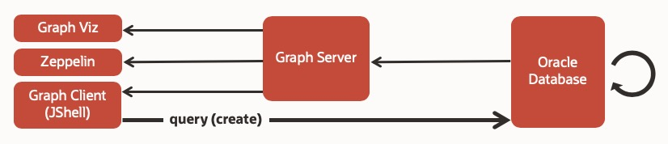
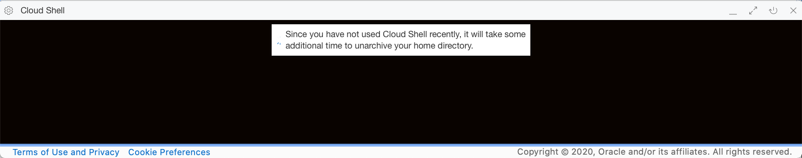
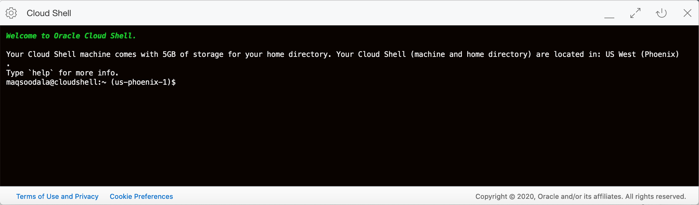

# Provision the Lab Environment

The lab environment will be provisioned in Oracle Cloud Infrastructure and you will access it from a local machine. In order to minimize the steps and automate the provisioning process, you will use Oracle Cloud Infrastructure **Resource Manager** for provisioning.

>OCI **Resource Manager** is a managed service that can provision all Oracle Cloud Infrastructure resources and services. Resource Manager reduces configuration errors and increases productivity by managing infrastructure declaratively (i.e. "infrastructure as code") using industry standard Hashicorp Terraform®. Click [here](https://docs.cloud.oracle.com/en-us/iaas/Content/ResourceManager/Concepts/resourcemanager.htm) to learn more about Resource Manager.

### Lab Environment Architecture

The lab environment for the workshop consists of the following components:

* Oracle Cloud Infrastructure Compute Service
* Oracle Autonomous Transaction Processing Database
* Oracle Graph Server and Client
* Apache Zippelin for Graph visualization

UPDATE PIC



### Prerequisites

* [Download](../setup/terraform/vcn-compute.zip) the prebuilt Terraform script for this workshop

## **STEP 1** : Sign In to Oracle Cloud Infrastructure Console

Sign in to your **Cloud Account** from Oracle Cloud website. You will be prompted to enter your cloud tenant, user name, and password.

>If this is your first time signing in to Oracle Cloud Infrastructure, or for detailed sign in instructions, refer to [*Getting Started with Oracle Cloud*](https://docs.oracle.com/en/cloud/get-started/subscriptions-cloud/csgsg/sign-your-cloud-account.html).

## **STEP 2** : Create SSH Key Pair Using Cloud Shell

The SSH (Secure Shell) protocol is a method to enable secure access and communication over insecure networks through cryptographically secured connections between endpoints.

Oracle Cloud Infrastructure compute instances uses an SSH key pair instead of a password to authenticate a remote user. A key pair file contains a private key and public key. You keep the private key on your computer and provide it every time you connect to the instance. The public key is kept on the compute instance.

In this step you will use **Oracle Cloud Shell** to create an SSH key pair.

>For the purpose of this lab, Oracle Cloud Shell is the recommended interface for creating SSH keys as it does not require any local setup on your computer. However, you are free to choose any interface that you are familiar with for creating SSH keys (click [here](https://www.oracle.com/webfolder/technetwork/tutorials/obe/cloud/compute-iaas/generating_ssh_key/generate_ssh_key.html) for other methods for generating SSH Keys).

>**Note:** You may skip this step if you already have an SSH key pair that you like to use.

### Start the OCI Cloud Shell

The Cloud Shell machine is a small virtual machine running a Bash shell which you access through a web browser via the Oracle Cloud Infrastructure Console. The cloud shell provides a pre-authenticated OCI CLI (Command Line Interface) set to the your tenancy's current region, as well as other tools and utilities.

>To use the Cloud Shell, your tenancy administrator must grant the required IAM (Identity and Access Management) policy.

1. Start Oracle Cloud Shell by clicking the Cloud Shell icon  at the top right of Oracle Cloud Infrastructure console page. The cloud shell takes few seconds to initialize.



2. A Bash Shell prompt will be presented after the session initializes.



### Create an SSH Key Pair

1. Create a folder to store the SSH keys.

````
<copy>mkdir -p ~/oracle-pg
cd ~/oracle-pg</copy>
````


2. Create an SSH key pair using **ssh-keygen**, replacing **```<<ssh_keyfile>>```** with your own. Press ENTER twice for no passphrase.

>**Note:** The angle brackets **<< >>** should not appear in your code.

````
ssh-keygen -b 2048 -t rsa -f <<ssh_keyfile>>
````


3. Examine the two files that were just created. Again, replace ```<<ssh_keyfile>>``` with the one you have used in the previous step.

````
ls <<ssh_keyfile>> <<ssh_keyfile>>.pub
````


4. List the contents of the private key. Copy the contents to a document (e.g. Notepad) as you will be needing it in the next step.

````
cat <<ssh_keyfile>>.pub
````


>When pasting the key in future steps, make sure that you remove any hard returns that may have been added when copying. If the SSH key is not preserved correctly, you will not be able to connect to your environment.

## **STEP 3** : Provision Lab Environment Using Resource Manager

**Resource Manager** removes the complexity and operational burden of deploying and managing infrastructure so you can focus on building great apps. With Resource Manager you can orchestrate most Oracle cloud resources using a point-and-click and easy-to-use interface.

The main component of resource manager is a **Stack**, which is a collection of Oracle Cloud Infrastructure resources corresponding to a given Terraform configuration. Each stack resides in the **Compartment** you specify, in a single **Region**. However, resources in a given stack can be deployed across multiple regions.

### Required Information for Resource Manager

| Resource       | Value |
|----------------|-------|
|Tenancy OCID    |Locate your [Tenancy OCID](https://docs.cloud.oracle.com/en-us/iaas/Content/General/Concepts/identifiers.htm)|
|Compartment OCID|Locate your [Compartment OCID](https://docs.cloud.oracle.com/en-us/iaas/Content/General/Concepts/identifiers.htm) (It is preferred to create a [New Compartment](https://docs.cloud.oracle.com/en-us/iaas/Content/GSG/Tasks/choosingcompartments.htm), but you may use an existing compartment as well)|
|Cloud Region Identifier | Retrieve the [Cloud Region Identifier](https://docs.cloud.oracle.com/en-us/iaas/Content/General/Concepts/regions.htm) of the Cloud region where you like the environment to be created|
|SSH Public Key   |SSH Public Key from the key pair created in the previous step|
|ADB Admin Password | Password for the ADMIN account (refer to [password rules](https://docs.oracle.com/en/cloud/paas/autonomous-data-warehouse-cloud/user/manage-users-admin.html#GUID-B227C664-EBA0-4B5E-B11C-A56B16567C1B))|

### Create the Resource Manager Stack

Creating a **Stack** involves uploading the Terraform configuration file, providing identifying information for the new stack, and (optionally) setting the variables.

1. Open the **Navigation Menu** on the top-left. Under **Solutions and Platform**, locate **Resource Manager** and click **Stacks**.


2. Choose a **Compartment** that you have permission to work in (towards the left of the page), and ensure you are in the correct **Region** (towards the top of the page). Click **Create Stack**.

> You may choose the same compartment as the lab environment for the Stack.


3. In the **Create Stack** dialog, enter the following :

	* Ensure **My Configuration** is selected.

	* Add the Terraform configuration file that you've downloaded earlier. You can either drag and drop it onto the dialog box or click **Browse** and navigate to the file location.

	* Leave the **Working Directory** as default.

	* Enter a **Name** for the new stack (or accept the default name provided).

	* Optionally, enter a **Description**.

	* From the **Create in Compartment** drop-down, select the **Compartment** where you want to create the stack.

	* Select the **Terraform Version** as **0.12**.
		>**IMPORTANT:** The scripts require Terraform 0.12. Ensure you select the correct version as Terraform is not backwards compatible.

	* Optionally, you can apply tags.
		>Refer to the documentation section [**Tagging Overview**](https://docs.cloud.oracle.com/en-us/iaas/Content/Tagging/Concepts/taggingoverview.htm) for details on OCI Tagging.

	* Click **Next**.

4. Next, enter the values from **Required Information for Resource Manager** section above. These values are input to the Terraform scripts that will be run in the later steps. Click **Next**.

5. In the **Review** panel, verify your stack configuration.
Click **Create** to create the Stack.

6. Verify the Stack creation on the **Stack Details** page.

### Run the Plan Job

Running a plan job parses the Terraform configuration (.zip) file and converts it into an execution plan listing resources and actions that will result when an apply job is run. We recommend generating the execution plan before running an apply job.

1. On the previous **Stack Details** page, click on **Terraform Actions** -> **Plan**.

2. Review the plan job **Name** and update if needed. Click **Plan**.

3. The new plan job is listed under **Jobs**, with an initial state of **Accepted**. Soon the status changes to **In Progress**.

4. When the plan job is successful, the status will change to **Succeeded**.

5. Scroll to the bottom of the plan log and verify there are no errors, and the plan indicates the resources will be added.

### Run the Apply Job

When you run the apply job for a Stack, Terraform creates the resources and executes the actions defined in the Terraform configuration (.zip) file. The time required to complete an apply job depends on the number and type of cloud resources to be created.

1. Browse to the **Stack Details** page by clicking the link from the breadcrumbs as follows :

2. Go to **Terraform Actions** and select **Apply**.

3. In the **Apply** dialog, review the apply job **Name** and ensure the **Apply Job Plan Resolution** is set to **Automatically Approve**.

	> You may optionally add **Tag** information. Refer to the documentation section [*Tagging Overview*](https://docs.cloud.oracle.com/en-us/iaas/Content/Tagging/Concepts/taggingoverview.htm) for details on OCI Tagging.

4. Click **Apply**.

5. The new apply job gets **Accepted** status.

6. The apply job status will quickly change to **In Progress**.

7. The job will take a few minutes to complete and will change status to **Succeeded** when successfully completed.

8. Verify the apply log by scrolling down to the **log** section and validate the resource creation was successful.

## **STEP 4** : Validate Provisioning

Gather the following information from the apply log in the above step.

|-|-|
|**VM IP Address**| IP Address of the Compute Instance|
|**ADB DB Name**| Database Name of the Autonomous Database|

[[PIC]]

### Log In to the Compute Instance

The compute instance provisioned for the lab is a Linux VM. You will be installing **Oracle Graph** software and other components on this VM in the later steps.

> To minimize the configuration steps, the provisioning done by resource manager pre-configures the following components on the compute instance:
>* Oracle Instant Client 18.3
>* Autonomous Database Wallet
>* JDK 8 & 11

1. Using **Cloud Shell** (or the SSH client used earlier to create the SSH keys), log in to the compute instance using **ssh**, your **Private Key** and the **VM\_IP\_Address**, as follows:

```
ssh -i <<private_key>> opc@<<vm_ip_address>>

```

[[PIC]]

### Validate Connectivity to the Autonomous Database

The Autonomous Database provisioned for this lab will hold the sample data. Validate the connectivity to the autonomous database using the below steps.

>Oracle Database includes a property graph feature that provides graph storage, a SQL-like graph query language, and powerful built-in social graph analytics for making recommendations, finding communities and influencers, pattern matching, and identifying fraud and other anomalies. Click to learn more about [Oracle Database Graph](https://www.oracle.com/database/technologies/spatialandgraph.html) features.

1. In a SSH session logged in as the **opc** user, switch the user to **oracle**.

````
<copy>sudo su - oracle</copy>
````
[[PIC]]

2. Log in to the autonomous database using **SQL Plus**. You will connect as the **ADMIN** user using the **ADB\_Admin\_Password** supplied to resource manager earlier, and to the predefined database **Service Name** that is built using **ADB DB Name** (captured in the previous step) and the following rules:

	**```<<Service_Name>> : <<ADB_DB_Name>>_<<Service_Type>>```**

	Where ```**<<Service_Type>>**``` is either **tp, tpurgent, low, medium, high** (To learn more about predefined autonomous database services, click [here](https://docs.oracle.com/en/cloud/paas/atp-cloud/atpug/connect-predefined.html#GUID-9747539B-FD46-44F1-8FF8-F5AC650F15BE)

```
sqlplus ADMIN/<<ADB_Admin_Password>>@<<Service_Name>>
```

[[PIC]]

## Summary

You have now successfully setup the lab environment to be used for the remaining steps. Please proceed to the next lab using the **Lab Contents** menu on your right.
