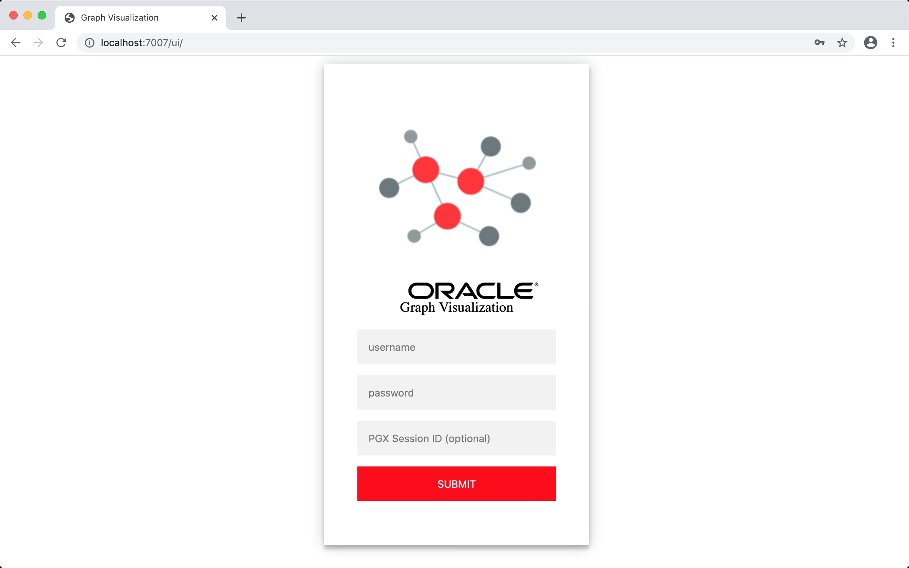
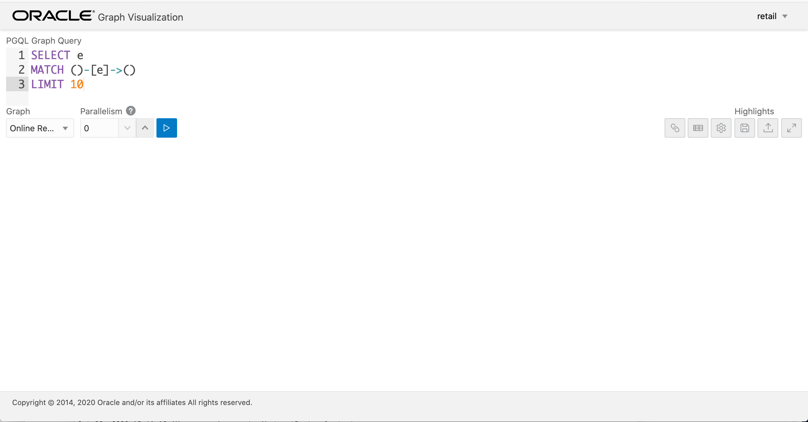
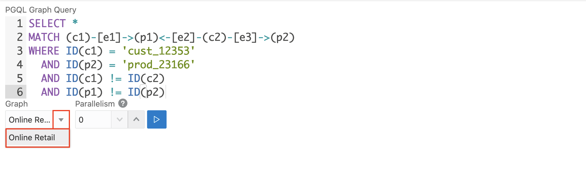
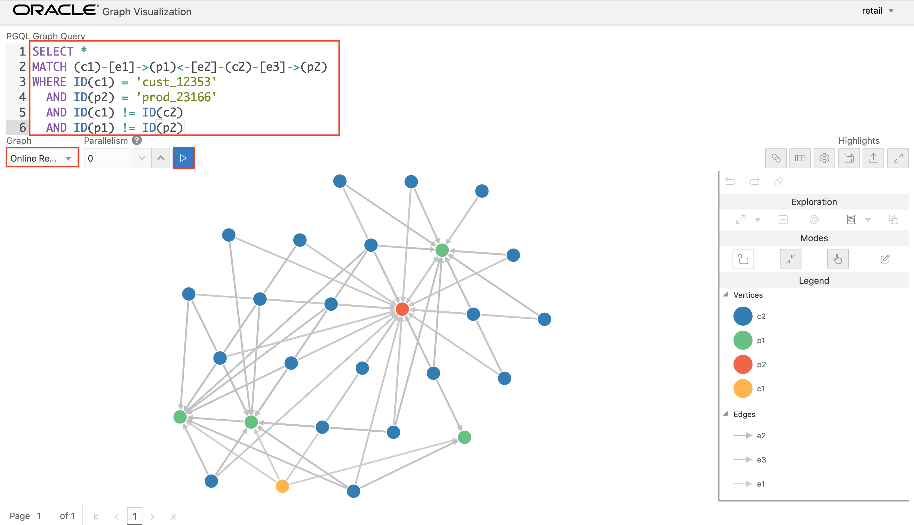
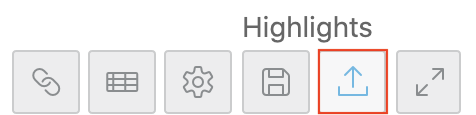
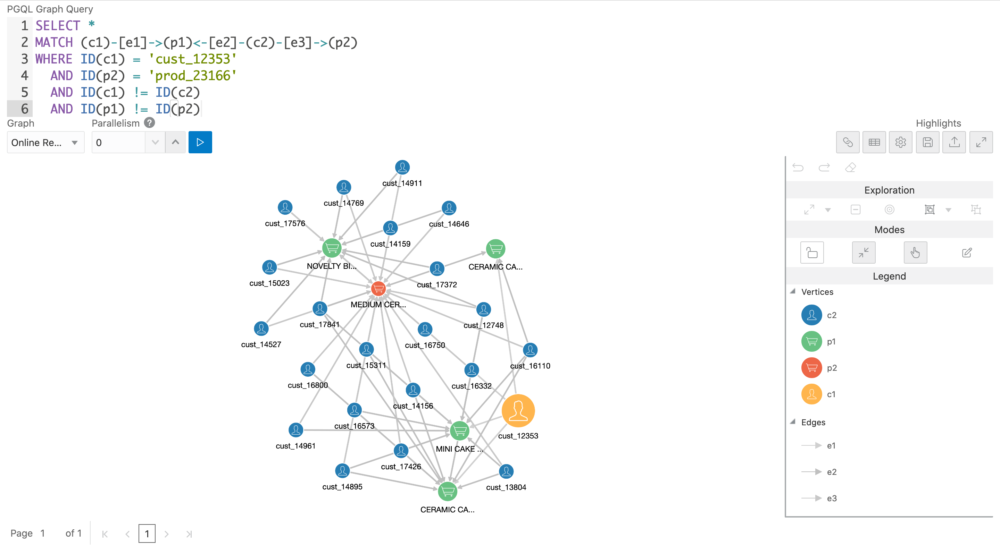

# Graph Visualization using GraphViz

## Introduction

**GraphViz** is a single-page web application that works with the in-memory graph analytics server. GraphViz takes PGQL queries as an input and renders the result visually. A rich set of client-side exploration and visualization features can reveal new insights into your graph data.

## **STEP 1**: Login to GraphViz

The Graph Server automatically runs graph visualization application on port 7007 in embedded mode.

>GraphViz can be deployed in embedded mode or in Apache Tomcat or Oracle Weblogic Server. In this lab we will use the embedded mode of GraphViz.

1. From your laptop/desktop, open a new web browser and point to the following URL, replacing the **{VM IP Address}** with your lab VM's IP Address.

```
<copy>http://</copy>{VM IP Address}<copy>:7007/ui</copy>
```

2. Login to GraphViz using the database credentials of the RETAIL user (remember we setup Graph to use Oracle database for authentication)

  Enter **RETAIL** as the username and **{Retail Password}**, along with the **PGX Session ID** copied in the previous lab.



3. Upon a successful login you will be presented the following home page. The principal points of entry for the GraphViz application are the query editor and the graph lists.



## **STEP 2**: Run PGQL Query

1. Copy/paste the PGQL query below to see the paths between the customer **cust_12353** and the top recommended product shown earlier.

```
<copy>
SELECT *
MATCH (c1)-[e1]->(p1)<-[e2]-(c2)-[e3]->(p2)
WHERE ID(c1) = 'cust_12353'
  AND ID(p2) = 'prod_23166'
  AND ID(c1) != ID(c2)
  AND ID(p1) != ID(p2)
</copy>
```

2. Select the graph **Online Retail** from the drop-down. The graphs visible in the drop-down indicate they were successfully loaded at in PGX.



3. Run the query by clicking the **Run** button. Verify the Graph output.



## **STEP 3**: Highlight the Graph

The Highlights tab includes customization options that let you modify the appearance of edges and vertices. Highlighting can be applied based on conditions (filters) on single or multiple elements.

You can export and import highlight options by clicking the **Save** and **Load** buttons in the main window. Save lets you persist the highlight options, and Load lets you apply previously saved highlight options.

1. Download [**highlights.json**](https://objectstorage.us-phoenix-1.oraclecloud.com/n/oraclepartnersas/b/oracle_pg/o/highlights.json) and save it to your local machine. In this file, the highlights for the retail graph were configured to add icons and change the size of icons according to personalized page ranks (PPR).

2. Import highlights.json by clicking **Import**.



3. After the highlights are imported, note the icons get added to the nodes and their size is changed according to their PPR.



You may proceed to the next lab.

## Acknowledgements

- **Author** - Maqsood Alam, Product Manager, Oracle Database
- **Contributor** - Ryota Yamanaka, Product Manager, Oracle Spatial and Graph
* **Last Updated By/Date** - Maqsood Alam, Oct 2020

## See an issue?
Please submit feedback using this [form](https://apexapps.oracle.com/pls/apex/f?p=133:1:::::P1_FEEDBACK:1). Please include the *workshop name*, *lab* and *step* in your request.  If you don't see the workshop name listed, please enter it manually. If you would like for us to follow up with you, enter your email in the *Feedback Comments* section.
